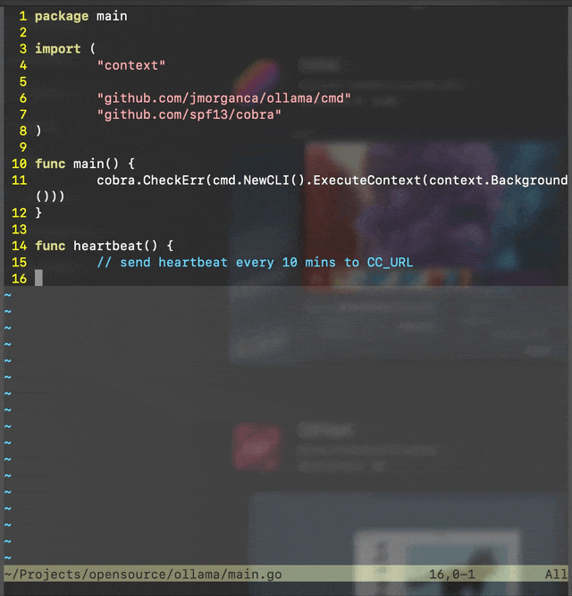

# Codecomp

Copilot like code suggestions using RAG. Currently only plugins for [Lem](https://github.com/lem-project/lem) editor and Vim (with textprop support, > 9.0.0185).

## Demo

### Lem

https://github.com/asutoshpalai/codecomp/assets/8471682/89621c81-2f2f-4233-9130-5c3ca80198bd

### Vim



## Setup

- Clone the repo
```
$ git clone https://github.com/asutoshpalai/codecomp
$ cd codecomp
```

- Download the embedding model
```
$ curl -OL 'https://huggingface.co/nomic-ai/nomic-embed-text-v1.5-GGUF/resolve/main/nomic-embed-text-v1.5.Q8_0.gguf?download=true'
```

- Export the following environment variables or create an `.env` file contianing
the following variables.

```
export OPENAI_BASE_URL="https://api.openai.com/v1"
export OPENAI_API_KEY="skynet-launch-codes"
export OPENAI_MODEL_NAME="gpt-3.5-turbo-0613"
```

__Note:__ Strongly using [Groq](https://wow.groq.com/) becuase of how fast it is.
Groq has an [OpenAI compatible API](https://console.groq.com/docs/openai) which
can be used here.

- Launch the Python server from the same shell. I haven't commited the dependency
file yet. Please install anything that it complains about. Some errors might show
up while serving the request.

```
$ python server.py
```

- Test that the server is working properly.
```
curl -X POST -v http://localhost:8000/code_complete/invoke --header 'Content-Type: application/json' --data-raw '{
        "input": {
        "repo_path": "/home/user/projects/lem-codecomp/",
        "language": "python",
        "partial_code": "def start_server(host: str, port: int):\n"
  }
}'
```

### Vim

- Install the plugin. You can use [vim-plug](https://github.com/junegunn/vim-plug)
to install as follows:

```
Plug 'asutoshpalai/codecomp'
```

- Add keybindings to invoke code completion

```
imap <C-a> <esc>:Codecomp<cr>i
imap <C-e> <esc>:CodecompAccept<cr>i
imap <C-s> <esc>:CodecompReject<cr>i
```

### Lem

- Load this in your Lem's `init.lisp` file. Add the following lines to the init file.
```
(push "/home/remote/Learning/llm/anyscale/" asdf:*central-registry*)
(ql:quickload :lem-codecomp)
```
